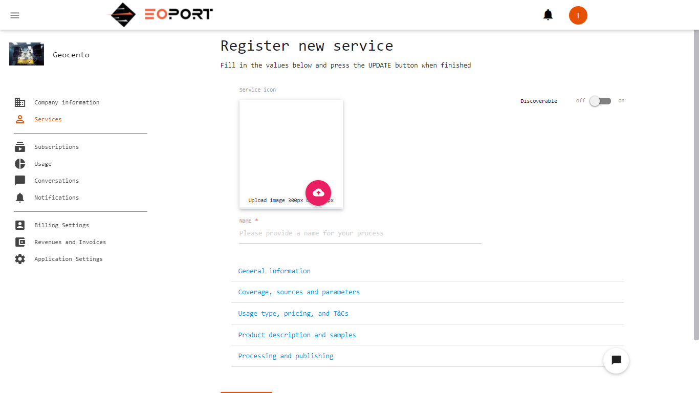
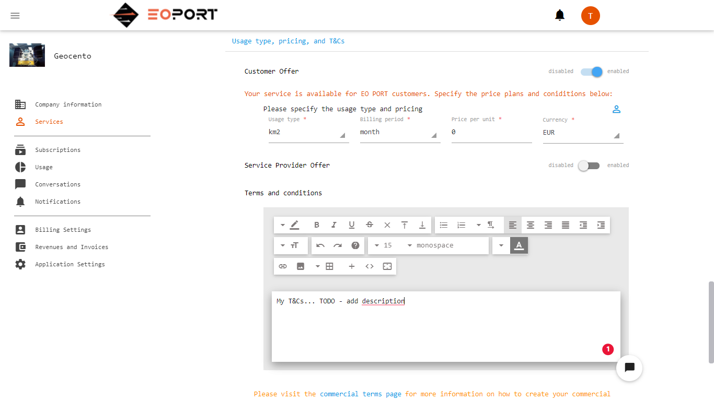
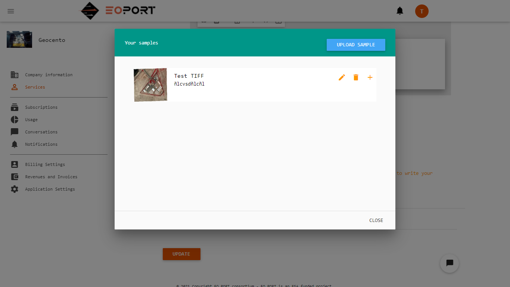

# Develop and register a new service in EOPORT

This repository contains a sample service which interfaces with the EOPORT production workflow. You can use it as a baseline code for your services.

Please follow the following steps:
- Before registering the service you need to be registered as a supplier in EOPORT. Please contact our support staff @ support@eoport.com for this.
- Once you are registered and all set with your supplier account, navigate to the services page
- In the services page, create a new service pressing the top left button. This should open a new page with a form to fill in all the necessary information.

 Fill in the values as appropriate. 
 - The first section 'General Information' is for marketing purpose. This is the information which will be used to present your service to users when they browse EOPORT.
 - The second section is about your service's characteristics, it's coverage, input sources and input parameters. The sources represent the input data to your service. You have the choice of interfacing directly with the Ground Stations' network input stream by selecting satellites directly or with another higher level service. The Ground Station input stream is generally highly technical (IP packets) and is normally not directly used unless you have a deep understanding of their protocol. Toggle between the two using the switch button. Finally, you can provide some textual information on time to delivery. The purpose is to give some indication to the user as to how fast your processing will be.
 - The third section allows you to specify your commercial offering. There are two channels to selling your service, either directly to end users of the platform or to other service providers so it can be integrated in their service as an input. You can do this by setting on or off the appropriate switches. The terms and conditions section is used to provide general T&Cs for your service. The customer will have to accept your T&Cs at the moment of ordering. In the example image below the service is only configured for EOPORT end users.

 - The fourth section lets you provide information on the actual products output of your service. You can add samples that the user will be able to view and download. Adding samples is done through a sample management dialog as illustrated by the image below. You can upload new samples and add samples to your service.

 - The fifth section relates to how your service integrates with the internal EOPORT services. There are two end points URL to configure. The first one is the end point the production manager will call with a payload on how to access the input data. The second URL is optional and will be called a few minutes before the data is actually available. This allows your service to provision hardware resources if needed. You can also configure the retention time for your data as well as, if you wish to, the parameters for publishing your products in the EOPORT client.
 
 Once you have setup your parameters, save the service by pressing the update button at the bottom.
 
 The service is not made public by default. Once you are comfortable with the service description and setup, you can make it visible to users by switching the status to public at the top left of the page. 
 